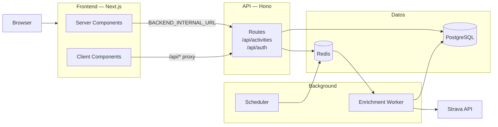
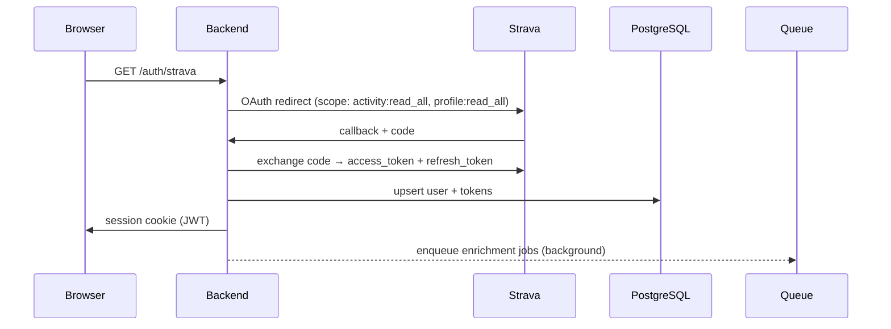
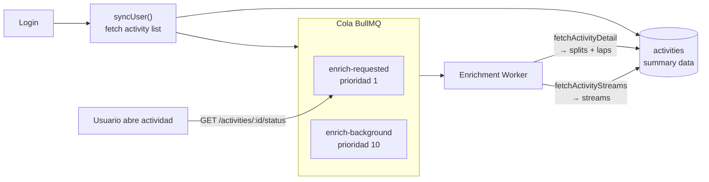

# Arquitectura — GPTrainer

## Stack

| Capa | Tecnología |
|---|---|
| Frontend | Next.js 16 (App Router) · Tailwind · Recharts · Leaflet |
| Backend | Hono (Node.js) · Drizzle ORM |
| Base de datos | PostgreSQL |
| Cola de trabajos | BullMQ + Redis |
| Proveedor de datos | Strava API |
| Infraestructura | Docker Compose |

---

## Componentes del sistema



---

## Flujo de autenticación



---

## Flujo de sincronización y enriquecimiento



---

## Módulos del backend

```
backend/src/
├── modules/
│   ├── auth/          OAuth Strava · gestión de sesión · refresh de tokens
│   ├── activities/    GET /api/activities · GET /api/activities/:id · GET /api/activities/:id/status
│   └── sync/
│       ├── service.ts         syncUser() — orquesta sync + encola enrichment
│       ├── enrichment.ts      enrichDetail() · enrichStreams()
│       ├── zones.ts           syncAthleteZones()
│       └── providers/
│           └── strava.ts      normalización Strava → modelo interno
├── queue/
│   ├── index.ts               conexión Redis · definición de colas
│   ├── enrichment-producer.ts enqueueRequested() · enqueueBackground()
│   └── enrichment-worker.ts   worker BullMQ · lógica de procesamiento
└── scheduler/
    └── index.ts               safety net cada 15min para actividades sin enriquecer
```

---

## Modelo de datos (tablas principales)

```
users
  └── activities          (summary: name, distance, time, polyline...)
        ├── activity_streams   (latlng[], heartrate[], velocity[], altitude[]...)
        ├── activity_splits    (por km: pace, elevation, zone)
        └── activity_laps      (vueltas: distance, time, watts...)
  └── athlete_zones       (FC y potencia: rangos Z1-Z5)
```

---

## Prioridades de la cola de enriquecimiento

```
enrich-requested    →  prioridad 1  — usuario abre una actividad concreta
enrich-background   →  prioridad 10 — enriquecimiento automático del historial
```

**Fuente de verdad:** siempre la BD (`detail_fetched_at`, `streams_fetched_at`).
Redis solo almacena trabajo pendiente — los jobs completados se eliminan (`removeOnComplete: true`).

---

## Frontend — estructura de rutas

```
app/
├── page.tsx                  Landing / login con Strava
└── (app)/
    ├── layout.tsx            Layout autenticado (sidebar)
    ├── dashboard/            (pendiente)
    └── activities/
        ├── page.tsx          Lista de actividades (paginada, filtrable)
        └── [id]/
            └── page.tsx      Detalle: mapa · gráfico · splits · laps
```
