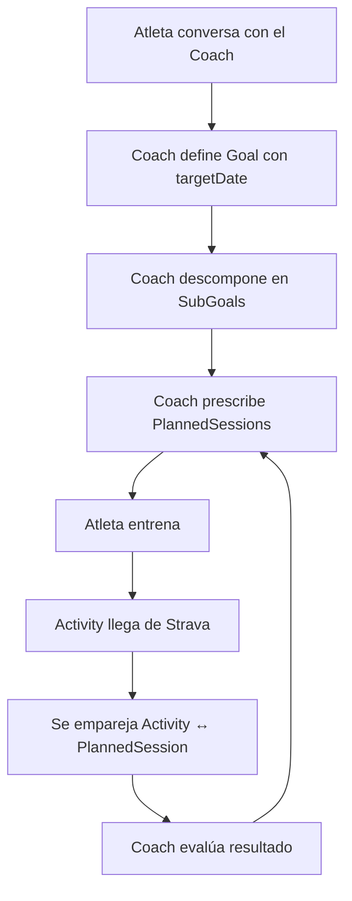
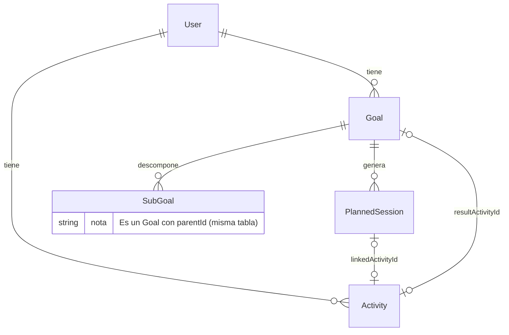

# MVP — Modelo de dominio v1

> Referencia: [`entities.md`](./entities.md) define el modelo conceptual completo.
> Este documento especifica qué se implementa en v1 y con qué simplificaciones.

---

## Alcance

**Foco principal**: la calidad de definición de Goal → SubGoals.
**Foco secundario**: PlannedSession básica para cerrar el ciclo plan ↔ realidad.

### Flujo v1

---

## Casos de uso MVP

| # | Caso de uso | Actor | Descripción |
|---|------------|-------|-------------|
| 1 | Crear Goal | Atleta + Coach | El atleta conversa con el coach y define un objetivo concreto |
| 2 | Descomponer en SubGoals | Coach | El coach genera los subobjetivos fisiológicos necesarios para alcanzar el Goal |
| 3 | Prescribir PlannedSessions | Coach | El coach genera sesiones de entrenamiento vinculadas al Goal |
| 4 | Registrar entrenamiento | Sistema (Strava) | La Activity llega automáticamente vía webhook de Strava |
| 5 | Emparejar Activity ↔ PlannedSession | Coach | Se vincula lo planificado con lo ejecutado (linkedActivityId) |
| 6 | Evaluar y re-planificar | Coach | El coach evalúa el resultado y ajusta futuras sesiones |
| 7 | Cerrar Goal | Atleta + Coach | Completar o cancelar el Goal, con resultado y actividad evidencia opcional |

---

## Entidades MVP

Solo dos entidades nuevas. Activity y sus componentes (streams, splits, laps) ya están implementadas y no se tocan.

### Relaciones

### Goal

| Campo | Tipo | Nullable | Notas |
|-------|------|----------|-------|
| id | serial PK | | |
| userId | FK → users | | |
| name | text | | "Sub 1:45 media maratón Valencia" |
| sport | text | | Taxonomía Strava |
| targetDescription | text | | Texto libre del objetivo |
| targetDate | timestamptz | ✓ | No todo Goal tiene fecha |
| priority | text | | `A` · `B` · `C` |
| parentId | FK → goals | ✓ | SubGoals |
| status | text | | `active` · `completed` · `cancelled` |
| resultDescription | text | ✓ | Resultado al cerrar |
| resultActivityId | FK → activities | ✓ | Actividad que evidencia el resultado |
| createdAt | timestamptz | | |
| updatedAt | timestamptz | | |

### PlannedSession

| Campo | Tipo | Nullable | Notas |
|-------|------|----------|-------|
| id | serial PK | | |
| goalId | FK → goals | | Siempre pertenece a un Goal |
| date | timestamptz | | Fecha de la sesión |
| sport | text | | Taxonomía Strava |
| title | text | | "Rodaje fácil 45min" |
| description | text | ✓ | El coach describe la sesión en texto libre |
| targetDuration | integer | ✓ | Minutos |
| status | text | | `planned` · `completed` · `skipped` |
| linkedActivityId | FK → activities | ✓ | Emparejamiento planned ↔ actual |
| createdAt | timestamptz | | |
| updatedAt | timestamptz | | |

---

## Qué se elimina del código actual

- Tabla `training_plans` — entidad rechazada
- Tabla `events` — diferida a v2
- Tabla `planned_sessions` actual — se reconstruye (goalId en vez de planId)
- Módulo `plans/` y `events/` — desaparecen
- Tool `update_plan` — se reemplaza por tools de Goal/PlannedSession

## Qué se difiere a iteraciones futuras

- Event como entidad (v2 — con FK opcional en Goal)
- Target estructurado en Goal (metric/value/unit)
- Prescription JSON estructurada en PlannedSession
- Intensidad objetivo como JSON (targetIntensity)
- Propiedades derivadas (predicción, probabilidad, progreso)
- Ordenamiento de sesiones en un día (orderInDay)
- Estado `paused` en Goal
